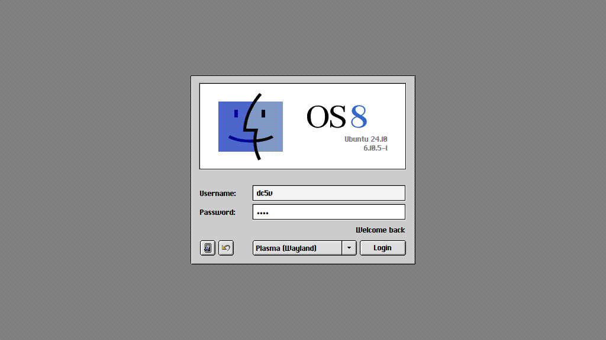

# sddm-theme-platinum-os8

Platinum OS8 style theme for KDE SDDM.

OS8 스타일의 KDE SDDM 테마입니다.



## How to install

```sh
git clone https://github.com/dc5v/sddm-theme-platinum-os8.git

cd sddm-theme-platinum-os8

# The SDDM theme path may vary depending on your system.
# 시스템에 따라 SDDM theme 경로가 다를 수 있습니다.
sudo cp -r ./sddm-theme-platinum-os8 /usr/share/sddm/themes

# Set 'platinum-os8' in SDDM settings.
# SDDM 설정에서 'platinum-os8'으로 설정하세요
systemsettings kcm_sddm 

# That's it all.
# 끗
sudo systemctl restart sddm
```